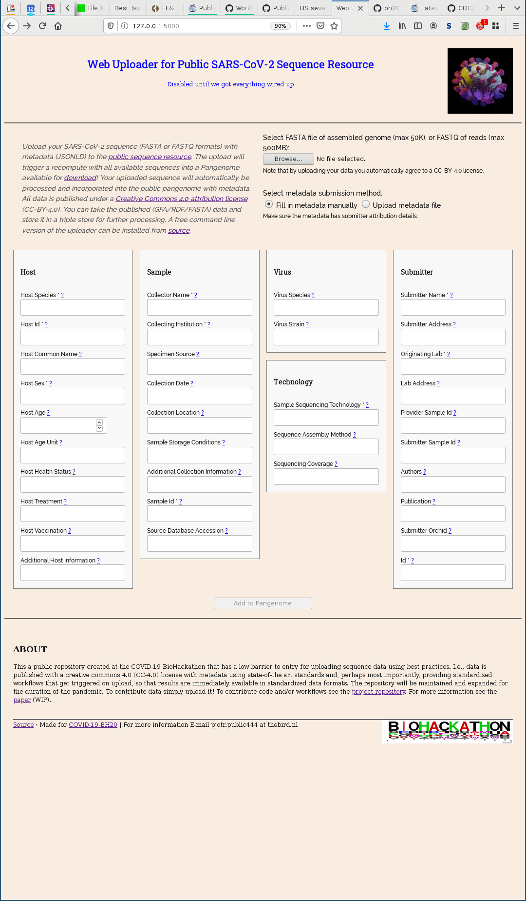

# COVID-19 PubSeq: Public Sequence uploader

[](https://gitter.im/arvados/pubseq?utm_source=badge&utm_medium=badge&utm_campaign=pr-badge&utm_content=badge)

This repository provides a sequence uploader for the COVID-19 Virtual
Biohackathon's Public Sequence Resource project. There are two
versions, one that runs on the command line and another that acts as
web interface. You can use it to upload the genomes of SARS-CoV-2
samples to make them publicly and freely available to other
researchers. For more information see the [paper](./paper/paper.md).



To get started, first [install the uploader](#installation), and use the `bh20-seq-uploader` command to [upload your data](#usage).

# Installation

There are several ways to install the uploader. The most portable is with a [virtualenv](#installation-with-virtualenv).

## Installation with `virtualenv`

1. **Prepare your system.** You need to make sure you have Python, and the ability to install modules such as `pycurl` and `pyopenssl`. On Ubuntu 18.04, you can run:

```sh
sudo apt update
sudo apt install -y virtualenv git libcurl4-openssl-dev build-essential python3-dev libssl-dev
```

2. **Create and enter your virtualenv.** Go to some memorable directory and make and enter a virtualenv:

```sh
virtualenv --python python3 venv
. venv/bin/activate
```

Note that you will need to repeat the `. venv/bin/activate` step from this directory to enter your virtualenv whenever you want to use the installed tool.

3. **Install the tool.** Once in your virtualenv, install this project:

Install from PyPi:

```sh
pip3 bh20-seq-uploader
```

Install from git:

```sh
pip3 install git+https://github.com/arvados/bh20-seq-resource.git@master
```

4. **Test the tool.** Try running:

```sh
bh20-seq-uploader --help
```

It should print some instructions about how to use the uploader.

**Make sure you are in your virtualenv whenever you run the tool!** If you ever can't run the tool, and your prompt doesn't say `(venv)`, try going to the directory where you put the virtualenv and running `. venv/bin/activate`. It only works for the current terminal window; you will need to run it again if you open a new terminal.

## Installation with `pip3 --user`

If you don't want to have to enter a virtualenv every time you use the uploader, you can use the `--user` feature of `pip3` to install the tool for your user.

1. **Prepare your system.** Just as for the `virtualenv` method, you need to install some dependencies. On Ubuntu 18.04, you can run:

```sh
sudo apt update
sudo apt install -y virtualenv git libcurl4-openssl-dev build-essential python3-dev libssl-dev
```

2. **Install the tool.** You can run:

```sh
pip3 install --user git+https://github.com/arvados/bh20-seq-resource.git@master
```

3. **Make sure the tool is on your `PATH`.** The `pip3` command will install the uploader in `.local/bin` inside your home directory. Your shell may not know to look for commands there by default. To fix this for the terminal you currently have open, run:

```sh
export PATH=$PATH:$HOME/.local/bin
```

To make this change permanent, assuming your shell is Bash, run:

```sh
echo 'export PATH=$PATH:$HOME/.local/bin' >>~/.bashrc
```

4. **Test the tool.** Try running:

```sh
bh20-seq-uploader --help
```

It should print some instructions about how to use the uploader.

## Installation from Source for Development

If you plan to contribute to the project, you may want to install an editable copy from source. With this method, changes to the source code are automatically reflected in the installed copy of the tool.

1. **Prepare your system.** On Ubuntu 18.04, you can run:

```sh
sudo apt update
sudo apt install -y virtualenv git libcurl4-openssl-dev build-essential python3-dev libssl-dev
```

2. **Clone and enter the repository.** You can run:

```sh
git clone https://github.com/arvados/bh20-seq-resource.git
cd bh20-seq-resource
```

3. **Create and enter a virtualenv.** Go to some memorable directory and make and enter a virtualenv:

```sh
virtualenv --python python3 venv
. venv/bin/activate
```

Note that you will need to repeat the `. venv/bin/activate` step from this directory to enter your virtualenv whenever you want to use the installed tool.

4. **Install the checked-out repository in editable mode.** Once in your virtualenv, install with this special pip command:

```sh
pip3 install -e .
```

5. **Test the tool.** Try running:

```sh
bh20-seq-uploader --help
```

It should print some instructions about how to use the uploader.

## Installation with GNU Guix

For running/developing the uploader with GNU Guix see [INSTALL.md](./doc/INSTALL.md)

# Usage

Run the uploader with a FASTA or FASTQ file and accompanying metadata file in JSON or YAML:

```sh
bh20-seq-uploader example/sequence.fasta example/metadata.yaml
```

## Workflow for Generating a Pangenome

All these uploaded sequences are being fed into a workflow to generate a [pangenome](https://academic.oup.com/bib/article/19/1/118/2566735) for the virus. You can replicate this workflow yourself.

An example is to get your SARS-CoV-2 sequences from GenBank in `seqs.fa`, and then run a series of commands

```sh
minimap2 -cx asm20 -X seqs.fa seqs.fa >seqs.paf
seqwish -s seqs.fa -p seqs.paf -g seqs.gfa
odgi build -g seqs.gfa -s -o seqs.odgi
odgi viz -i seqs.odgi -o seqs.png -x 4000 -y 500 -R -P 5
```

Here we convert such a pipeline into the Common Workflow Language (CWL) and
sources can be found [here](https://github.com/hpobio-lab/viral-analysis/tree/master/cwl/pangenome-generate).

For more information on building pangenome models, [see this wiki page](https://github.com/virtual-biohackathons/covid-19-bh20/wiki/Pangenome#pangenome-model-from-available-genomes).

# Web Interface

This project comes with a simple web server that lets you use the sequence uploader from a browser. It will work as long as you install the packager with the `web` extra.

To run it locally:

```
virtualenv --python python3 venv
. venv/bin/activate
pip install -e ".[web]"
env FLASK_APP=bh20simplewebuploader/main.py flask run
```

Then visit [http://127.0.0.1:5000/](http://127.0.0.1:5000/).

## Production

For production deployment, you can use [gunicorn](https://flask.palletsprojects.com/en/1.1.x/deploying/wsgi-standalone/#gunicorn):

```
pip3 install gunicorn
gunicorn bh20simplewebuploader.main:app
```

This runs on [http://127.0.0.1:8000/](http://127.0.0.1:8000/) by default, but can be adjusted with various [gunicorn options](http://docs.gunicorn.org/en/latest/run.html#commonly-used-arguments).
